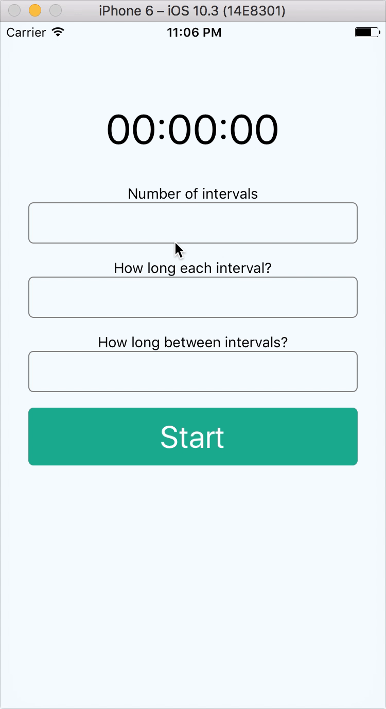

# intervalTraining

This is a simple app that let's you get feedback (vibration) at specific intervals

You set how many repetitions you want to do, how long each is and how long the break between repetitions.

This app will let you know with a vibration when the repetition/break is over.

**Caveats**: the app will keep the screen active and if put in background will pause until it's taken back as the "active" app.

